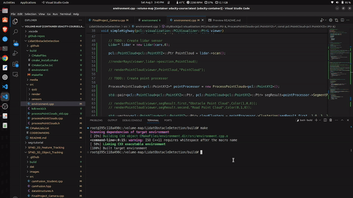

# C++ implementation of Lidar Obstacle Detection using Point Cloud Library 



## Overview

This project is part of the Udacity Sensor Fusion nanodegree program. It focuses on detecting obstacles using Lidar data, implementing segmentation, clustering, and tracking of objects.

## Project Structure

The project consists of several components including data handling, segmentation using the 3D RANSAC algorithm, and clustering using the Euclidean clustering algorithm with a KD-Tree.

## Requirements

* Ubuntu 16.04
* PCL - v1.7.2
* C++ v11
* gcc v5.5

## Local Installation

### Ubuntu 

1. Clone this github repo:

   ```sh
   git clone https://github.com/atharvahude/Lidar-Obstacle-Detection.git
   ```

2. Execute the following commands in a terminal

   ```shell
   sudo apt install libpcl-dev
   cd ~/SFND_Lidar_Obstacle_Detection
   mkdir build && cd build
   cmake ..
   make
   ./environment
   ```

   This should install the latest version of PCL. You should be able to do all the classroom exercises and project with this setup.
   
**Note** The library version of PCL being distributed by the apt repository for 18.04 and 20.04 are both older than v1.11. The following links have the information regarding the versions-

[Bionic 18.04](https://www.ubuntuupdates.org/package/core/bionic/universe/updates/libpcl-dev)
[Focal 20.04](https://www.ubuntuupdates.org/package/core/focal/universe/base/libpcl-dev)

You can either build PCL from source (for v1.11) or use the older version.

#### PCL Build from Source
[PCL Source Github](https://github.com/PointCloudLibrary/pcl)

## Video Demo

[](https://youtu.be/vKiNVd3vQqM)